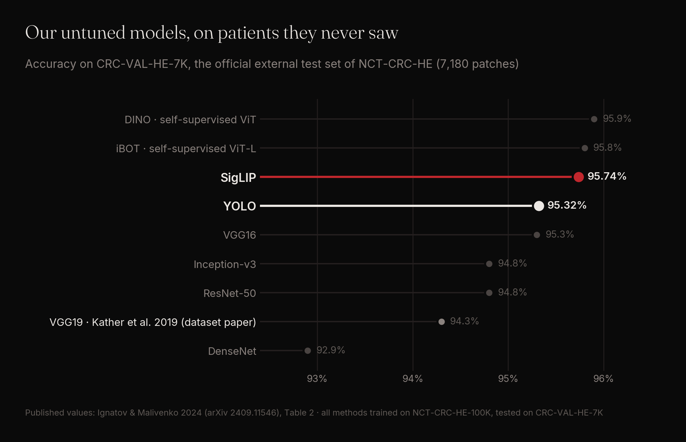
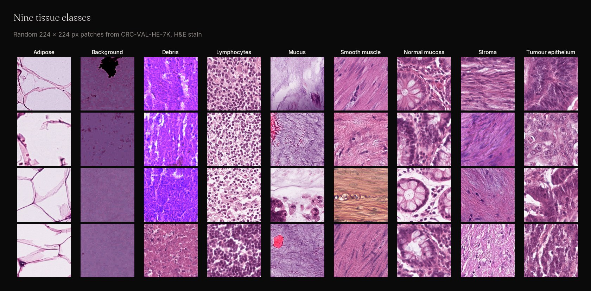
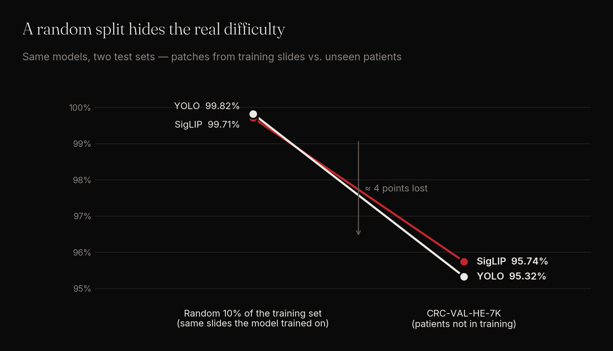
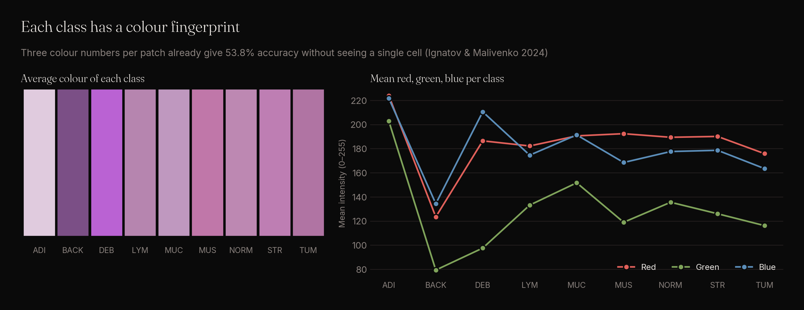
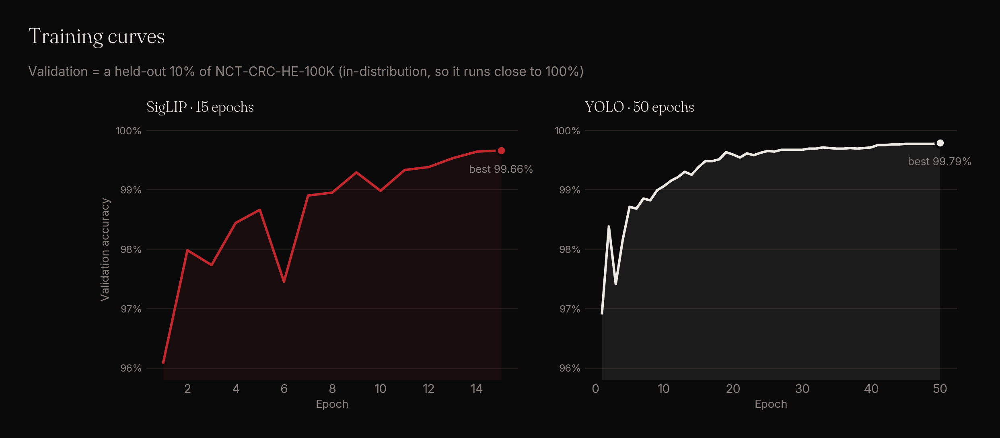
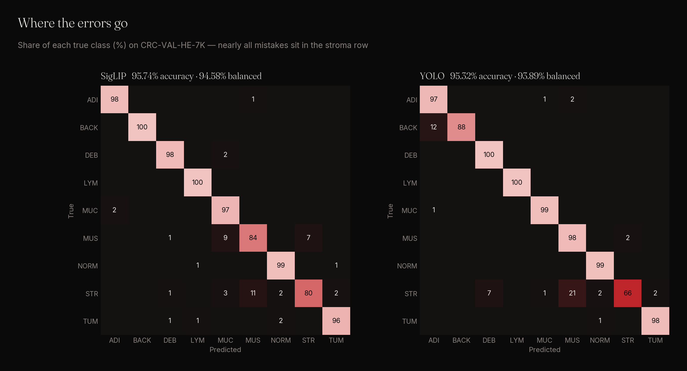
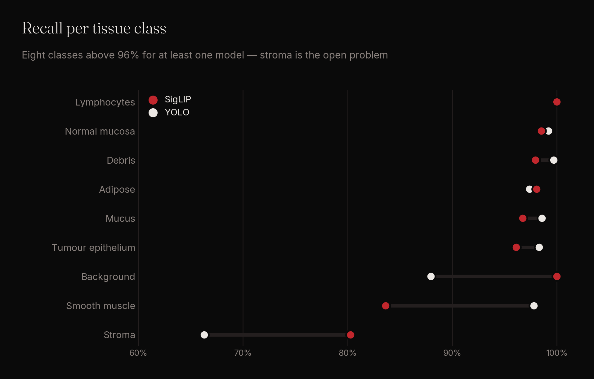
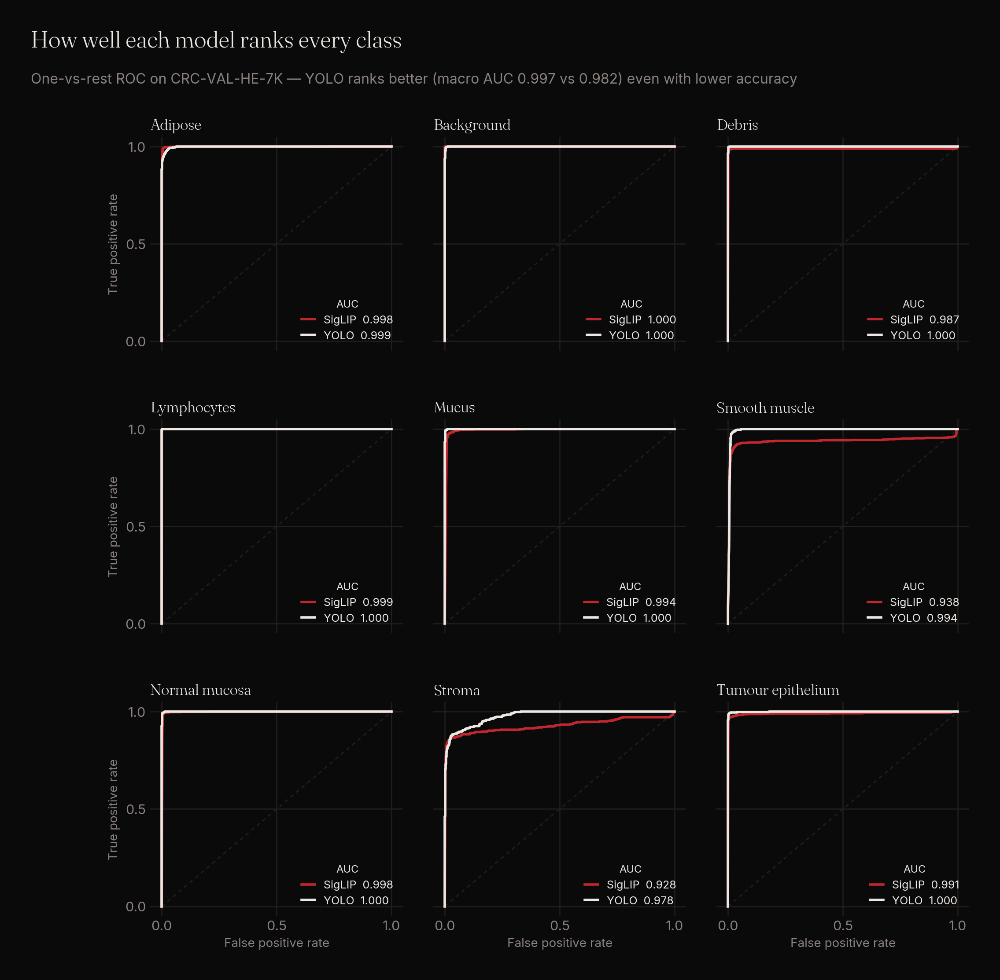
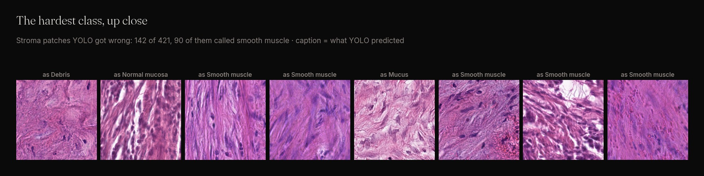

# Colorectal tissue classification on NCT-CRC-HE — tested the fair way

Two image classifiers, YOLO and SigLIP, were trained with one fixed recipe, **without dataset-specific tuning**, on the NCT-CRC-HE-100K colorectal histology dataset and evaluated on its **official external test set** (CRC-VAL-HE-7K).

**Result: 95.74 % (SigLIP) and 95.32 % (YOLO) accuracy on patients the models never saw — above the dataset authors' own model (94.3 %) and the classic CNN baselines, and within 0.2 points of self-supervised ViTs (DINO 95.9 %, iBOT 95.8 %), while training on about one third of the available images.**

| Model | Accuracy | Balanced accuracy | Macro AUC (one-vs-rest) |
|---|---|---|---|
| **SigLIP** (ours) | **95.74 %** | **94.58 %** | 0.9816 |
| **YOLO** (ours) | 95.32 % | 93.89 % | **0.9967** |

All numbers on CRC-VAL-HE-7K (7,180 patches, 9 tissue classes).

---

## Try it

| | |
|---|---|
| **Live demo** | [nct-crc-tissue.streamlit.app](https://nct-crc-tissue.streamlit.app) — drop an H&E patch and watch both models predict, side by side |
| **Model weights** | [SigLIP on Hugging Face](https://huggingface.co/ghostsas001/nct-crc-siglip) · [YOLO on Hugging Face](https://huggingface.co/ghostsas001/nct-crc-yolo) — ready to download, with usage code |

---

## The dataset

NCT-CRC-HE is one of the most used public benchmarks in computational pathology: 224 × 224 px patches of H&E-stained colorectal cancer tissue in nine classes.

| Split | Patches | Role |
|---|---|---|
| NCT-CRC-HE-100K | 100,000 (86 whole-slide images) | training |
| CRC-VAL-HE-7K | 7,180 (separate patients) | external test |

---

## The problems with this dataset

### 1. The random-split trap

The training set has **no slide or patient identifiers**. A random train/test split therefore puts patches from the same slide on both sides — the model is tested on tissue it has effectively already seen. Our own models show exactly this:

Tested on a random 10 % of NCT-CRC-HE-100K, both models score **~99.8 %**. On the external set the same models score **~95.5 %**. Any paper reporting 99 %+ on a random split of the 100K set is measuring memorisation of slides, not generalisation — which is why everything below is reported on CRC-VAL-HE-7K only.

### 2. A colour shortcut

Ignatov & Malivenko (2024) showed that the classes carry a strong colour signature from the staining and normalisation pipeline: **three numbers per image (mean R, G, B) are enough for 53.8 % accuracy**, and a plain colour histogram reaches **82.2 %** — without looking at a single cell.

### 3. JPEG artifacts and corrupted patches

The same study found that the TIFF files are re-saved JPEGs with **compression quality that differs between classes** (adipose and background are much more compressed than debris or normal mucosa), plus patches corrupted by wrong dynamic-range handling after stain normalisation. A model can learn these artifacts instead of tissue morphology.

---

## What others reported on CRC-VAL-HE-7K

Every method below was trained on NCT-CRC-HE-100K and tested on CRC-VAL-HE-7K — the same protocol as ours.

| Method | Type | Accuracy |
|---|---|---|
| DINO | self-supervised ViT | 95.9 % |
| iBOT | self-supervised ViT-L | 95.8 % |
| **SigLIP (ours)** | vision-language transformer, untuned | **95.74 %** |
| **YOLO (ours)** | CNN, untuned | **95.32 %** |
| VGG16 | CNN | 95.3 % |
| ResNet-50 | CNN | 94.8 % |
| Inception-v3 | CNN | 94.8 % |
| **VGG19 — Kather et al. 2019** | CNN, **dataset paper** | **94.3 %** |
| DenseNet | CNN | 92.9 % |

<b>Full leaderboard (including methods designed around this dataset)</b>

| Method | Balanced acc. | Accuracy |
|---|---|---|
| Ensemble of 2× EfficientNet-B0 (Ignatov & Malivenko 2024) | 97.44 % | 98.33 % |
| EfficientNet-B0 (Ignatov & Malivenko 2024) | 96.80 % | 97.73 % |
| DeepCMorph (cell-morphology-aware CNN) | 95.59 % | 96.99 % |
| CTransPath (pathology foundation model) | – | 96.52 % |
| Ensemble of 5 models | – | 96.26 % |
| Ensemble of 4 models | – | 96.16 % |
| DINO | 94.5 % | 95.9 % |
| iBOT | 94.4 % | 95.8 % |
| **SigLIP (ours)** | **94.58 %** | **95.74 %** |
| **YOLO (ours)** | **93.89 %** | **95.32 %** |
| VGG16 | – | 95.3 % |
| Inception-v3 | – | 94.8 % |
| ResNet-50 | – | 94.8 % |
| VGG19 (Kather et al. 2019) | – | 94.3 % |
| CONCH | 93.0 % | – |
| DenseNet | 90.3 % | 92.9 % |
| ImageNet features + SVM | 89.58 % | 92.24 % |
| Colour histogram + Random Forest | 76.17 % | 82.20 % |
| Mean R, G, B + Random Forest | 50.51 % | 53.80 % |

All published values as compiled in Ignatov & Malivenko 2024, Table 2. The top models were designed specifically around this dataset's colour and artifact issues and train on all 100,000 patches; ours use a fixed recipe and one third of the data.

---

## Our approach

Both models use one fixed training recipe that we apply unchanged to every dataset. The question here: **how far does that recipe go, with zero dataset-specific tuning?**

| | YOLO | SigLIP |
|---|---|---|
| Training | 50 epochs, 224 px, batch 64 | 15 epochs, lr 5e-5, batch 16 |
| Augmentation | Ultralytics defaults | flips, rotation, sharpness |
| Balancing | none | random oversampling of minority classes |
| Training data | max 4,000 patches per class (≈ 36,000 of 100,000) | same |
| Model selection | best epoch on a held-out 10 % of the 100K set | same |
| Test | CRC-VAL-HE-7K, evaluated once | same |

Nothing was tuned on the test set. Training ran on a single NVIDIA T4.

---

## Results in detail

### Where the errors go

Eight of the nine classes are above 96 % recall for at least one model. The errors concentrate in **stroma**, which is confused mostly with smooth muscle — two fibrous tissues that look alike at this magnification.

### Ranking quality

YOLO has the lower accuracy but the **higher macro AUC (0.9967 vs 0.9816)**: it ranks stroma and smooth muscle almost perfectly (AUC 0.978 / 0.994) — its stroma errors come from the decision threshold, not from failing to recognise the tissue.

### The hardest class, up close

142 of 421 stroma patches are misclassified by YOLO, 90 of them as smooth muscle. Stroma is also the weakest class for the best published model (82.7 % recall for the 2× EfficientNet-B0 ensemble).

---

## Take-aways

- **An untuned, fixed recipe beats the dataset paper** (95.74 % vs 94.3 %) and matches self-supervised ViTs, using one third of the training data.
- **Random splits of NCT-CRC-HE-100K are misleading**: the same models drop from ~99.8 % to ~95.5 % on patients not in training.
- **Stroma vs smooth muscle** is the remaining hard problem for every model, including the state of the art.

### Limitations

- One training run per model (no seeds / confidence intervals).
- Training capped at 4,000 patches per class; the full 100K set was not used.
- An average of both models' probabilities reaches 96.02 % accuracy, but that combination was only tried after seeing the individual test results, so it is not reported as a main result.

---

## References

- Kather J.N. et al. *Predicting survival from colorectal cancer histology slides using deep learning: A retrospective multicenter study.* PLoS Medicine 16(1): e1002730, 2019. [doi:10.1371/journal.pmed.1002730](https://doi.org/10.1371/journal.pmed.1002730)
- Dataset: NCT-CRC-HE-100K and CRC-VAL-HE-7K, [zenodo.org/records/1214456](https://zenodo.org/records/1214456)
- Ignatov A., Malivenko G. *NCT-CRC-HE: Not All Histopathological Datasets Are Equally Useful.* 2024. [arXiv:2409.11546](https://arxiv.org/abs/2409.11546)
- Ultralytics YOLO — [docs.ultralytics.com](https://docs.ultralytics.com)
- SigLIP (Google) — [huggingface.co/google](https://huggingface.co/google)
